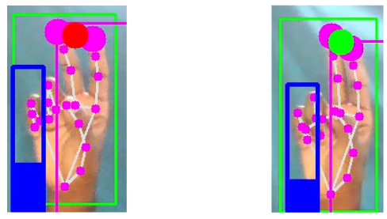

# HAND GESTURE RECOGNITION TO CONTROL PC

## Introduction 🧐

- Gestures are an important aspect of human interaction, both interpersonally and in the context of man-machine interfaces.

- A gesture is a form of non-verbal communication in which visible bodily actions communicate particular messages, either in place of speech or together and in parallel with words.

- Gestures include movement of the hands, face, or other parts of the body.

- Gesture recognition is an important skill for robots that work closely with humans. 

- Gesture recognition is especially valuable in applications involving interaction human/robot for several reasons

## Implemetation 🥵

There are basically 8 steps in achieving the goal

1. **Finding the hand landmarks**
    
    - We use findhands method provided in hand-tracking module to find the hand, and findposition method will give the landmark list. Both methods take the frame of  the video as input.  
    
</a>

2. **Get the tip of the fingers**

    - From the above landmark list, we get the coordinates of finger tip. landmark list contains the landmark IDs with its **x** and **y** coordinate.
    

3. **Check which fingers are up**
    
    - The method named fingerup in the handtracking module gives a list of length 5 which corresponds to our 5 fingers.
    
</a>

4. **Checking which condition it satisfies**

    - If only index finger is open then the cursor activates, we can move it as mouse.
    - If both index and middle fingers are open, cursor stops moving, and ready for clicking.
    - If all fingers are open or closed then it is ready to control brightness.
    - If only thumb and index are opened then it is ready to control volume.
    
</a>

5. **Convert coordinates(640, 480) to (1920, 1080)**

    - we convert the X, Y coordinate of finger tip from (0,640) to (0,1920) and (0,480) to (0,1080)
    - This is done in order to cover the mouse cursor on entire screen.

6. **Taking actions**

    - If the action that has to take is moving cursor, we can use mouse.move method provided by autopy library.
    - This method takes final cursor coordinates and moves the cursor accordingly. 
    - If the action is increase or decrease brightness we will take help of brightness control library to do the same. And we do same with volume.

7. **When index and middle finger are up :clicking mode**

    - Now we will find the distance between the tip of index and middle fingers. 
    - If the value is less than some threshold value, we consider it as click. 
    - we can achieve the mouse click action using autopy.mouse.click() method.
    
</a>

8. **Display**

    - At last we display the frame on window with brightness index, volume index, cursor points.

## Result 😎

</a>

### Team Members 😄
[Bhupathi Shwejan Raj](https://github.com/shwejanraj) | [Bolisetty Sujith](https://bolisettysujith.rocks) | [Janagama Vamshi Krishna](https://github.com/vamshijanagama) | [Suravarapu Ankith](https://github.com/Ankith-Suravarapu) | [Raja Pavan Karthik](https://github.com/RPKTHOR) |

**
# Happy Coding #
**